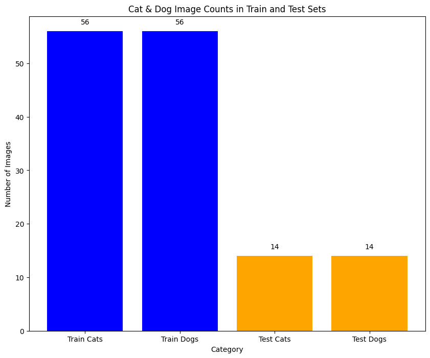
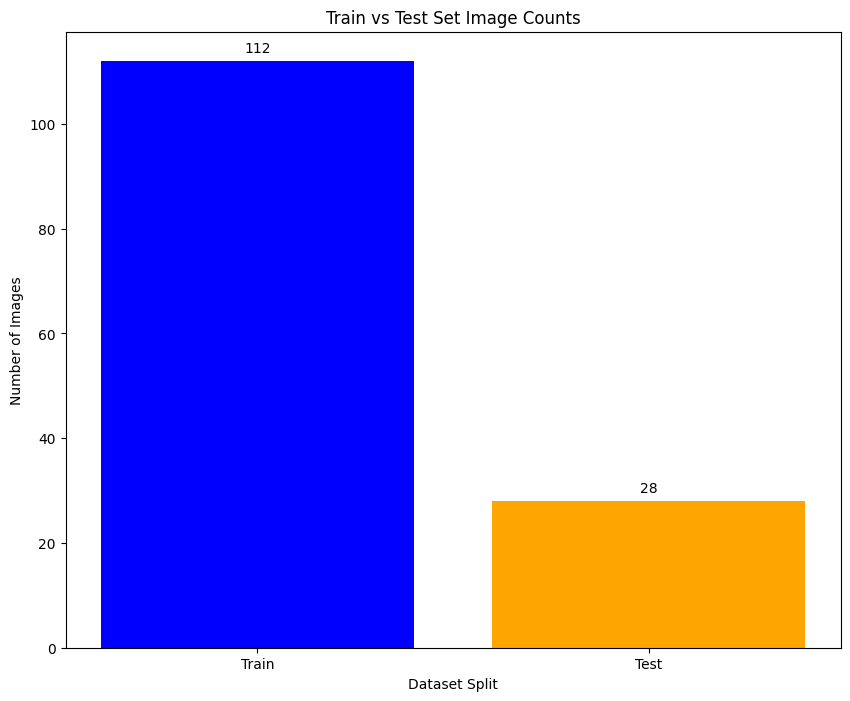
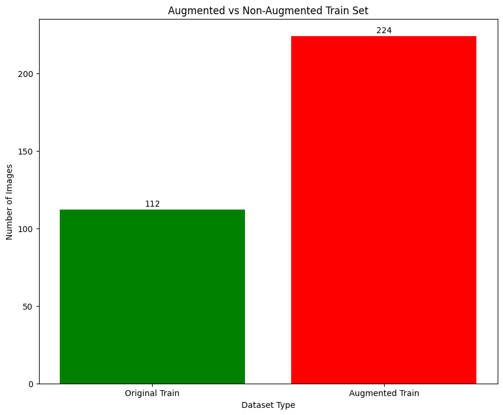
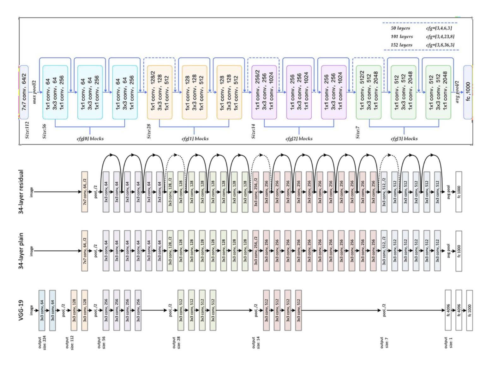

# CS 203: Software Tools & Techniques for AI
**IIT Gandhinagar**  
**Sem-II - 2024-25**

# Lab 05: Data Augmentation & Model Training for Image Classification

## Task 1 : Data Augmentation

#### a. Data Downloaded from
- Kaggle dataset: [Cats and Dogs Image Classification](https://www.kaggle.com/datasets/samuelcortinhas/cats-and-dogs-image-classification?select=test)

#### b. Dataset Overview
- The dataset contains 70 images for both Cats and Dogs.
- The dataset was split into 80% training and 20% testing:
  - Training Set: 56 images for each class (Cats & Dogs)
  - Test Set: 14 images for each class (Cats & Dogs)

#### c. Data Augmentation Process
- A custom data augmentation function was implemented using the **Augly** library.
- The following **10 augmentation techniques** were applied:
  - Rotation
  - Crop
  - Blur
  - Brightness
  - Contrast
  - Saturation
  - Horizontal Flipping
  - Vertical Flipping
  - Scaling
  - Padding
  - Random Noise
  
Each image in the original dataset was augmented 3 times using a combination of the techniques, resulting in a total of **224 augmented images** (2 times the original training dataset).

#### d. Dataset Statistics

| Dataset Type           | Original Count | Augmented Count | Total Count  |
|------------------------|----------------|------------------|--------------|
| **Training Set**        | 112 images     | 224 images       | 336 images   |
| **Testing Set**         | 28 images      | 0 images         | 28 images    |

#### e. Distribution of Cat and Dog Images
- A **bar graph** showing the number of cat and dog images in both the train and test sets, before and after augmentation.

---

### Task 2: Model Training

#### a. Model Details
- **Model Architecture**: ResNet-50 (Initialized with random weights)
- **Optimizer**: Adam (Learning rate = 0.01)
- **Loss Function**: Cross-Entropy Loss
- **Number of Epochs**: 7
- **Batch Size**: 32

Here models used for training with augmented and original data were initialised with same random weights, since deepcopy of a base model was made. 

#### b. Model Architecture Diagram
- **ResNet-50 Architecture** (as shown below)

#### c. Training Results

##### Model 1 (Without Augmentation):
- **Accuracy**: 57.14%
- **Precision**: 55.56%
- **Recall**: 71.43%
- **F1 Score**: 62.50%

##### Model 2 (With Augmentation):
- **Accuracy**: 71.43%
- **Precision**: 66.67%
- **Recall**: 85.71%
- **F1 Score**: 75.00%

---

## Results Analysis

- The model trained on original dataset shows consistent loss reduction but with a low accuracy of 57.14%. This could possibly be due to overfitting.

- The model trained on augmented data shows higher final training loss but it has better accuracy as compared to the model trained on the original dataset. This shows that augmentation of data is preventing overfitting.

- For other parameters, the model trained on augmented data has higher precision, recall and F1 score. This indicates that the model trained on augmented data generalizes better giving us more accuracy. 

- For training losses over epochs in both the model, we observe that there are some fluctuations. These fluctuations can be avoided implementing optimal learning rate and number of epochs. 